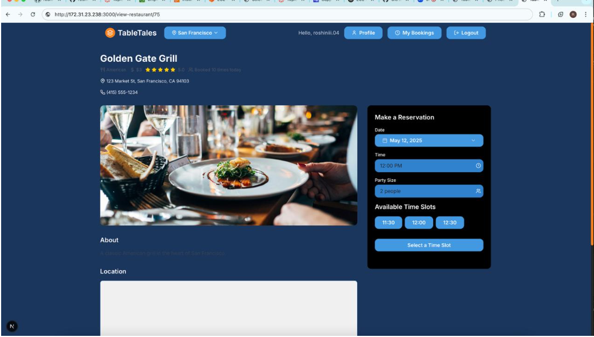

# BookTable-Role-Based-Restaurant-Reservation-Platform

# TableTales

A full-stack restaurant reservation system with a Django backend and a Next.js frontend.




## Table of Contents

- [Project Overview](#project-overview)
- [Features](#features)
- [Tech Stack](#tech-stack)
- [Repository Structure](#repository-structure)
- [Setup & Installation](#setup--installation)
- [Backend (Django)](#backend-django)
- [Frontend (Next.js)](#frontend-nextjs)
- [Environment Variables](#environment-variables)
- [Development Workflow](#development-workflow)
- [Deployment](#deployment)
- [Contributors](#contributors)
- [License](#license)

---

## Project Overview

Technominds is a modern restaurant reservation platform that allows users to search for restaurants, book tables, and manage their reservations. Restaurant owners can manage their listings, view bookings, and interact with customers.

---

## XP Core Values in Our Project

### Communication

Our team prioritized open and continuous communication throughout the project. We held regular meetings to discuss progress, clarify requirements, and resolve blockers. All members actively participated in code reviews, design discussions, and daily stand-ups, ensuring that everyone was aligned and informed. We used collaborative tools (such as Slack, GitHub Issues, and Google Docs) to document decisions and share updates, which helped us avoid misunderstandings and work efficiently as a distributed team.

### Feedback

We embraced feedback as a key driver for improvement. Frequent code reviews allowed us to catch issues early and learn from each other’s perspectives. We also sought feedback from our instructor and peers during demos and sprint reviews, using their input to refine features and improve usability. By integrating feedback loops into our workflow, we were able to adapt quickly, deliver higher quality code, and ensure the project met user needs.

---

## Features

- User authentication (JWT)
- Restaurant management (owners, menus, tables)
- Customer reservations and booking management
- Reviews and ratings
- Real-time table availability
- Email notifications
- Responsive UI

---

## Tech Stack

- **Frontend:** Next.js, React, TypeScript, Tailwind CSS
- **Backend:** Django, Django REST Framework, PostgreSQL
- **Other:** JWT Auth, Docker (optional for local dev), VSCode

---

### Backend (Django)

1. **Install dependencies:**
```bash
cd backend
python3 -m venv venv
source venv/bin/activate
pip install --upgrade pip
pip install -r requirements.txt
```

2. **Configure database:**
Edit `backend/settings.py` or use a `.env` file for:
```
DB_NAME=your_db_name
DB_USER=your_db_user
DB_PASSWORD=your_db_password
DB_HOST=localhost
DB_PORT=5432
```

3. **Run migrations and create superuser:**
```bash
python manage.py migrate
python manage.py createsuperuser
```

4. **Start the backend server:**
```bash
python manage.py runserver 0.0.0.0:8000
```

---

### Frontend (Next.js)

1. **Install dependencies:**
```bash
cd ../frontend
npm install --legacy-peer-deps
```

2. **Configure environment:**
Create `.env.local`:
```
NEXT_PUBLIC_API_URL=http://localhost:8000/api
NEXT_PUBLIC_GOOGLE_MAPS_API_KEY=your_google_maps_api_key
```

3. **Run the frontend:**
```bash
npm run dev
```
The app will be available at [http://localhost:3000](http://localhost:3000).

---

## Environment Variables

- **Backend:** Set DB credentials and allowed hosts in `backend/settings.py` or use a `.env` file.
- **Frontend:** Set `NEXT_PUBLIC_API_URL` and `NEXT_PUBLIC_GOOGLE_MAPS_API_KEY` in `.env.local`.

---

## Development Workflow

- Use feature branches for new features or bug fixes.
- Make regular, meaningful commits.
- Open pull requests for code review before merging to main.

---

## Deployment

- For production, use `npm run build` and `npm start` for the frontend.
- AWS EC2 instance
- Set environment variables for production.
- Consider using Docker for containerized deployment.


